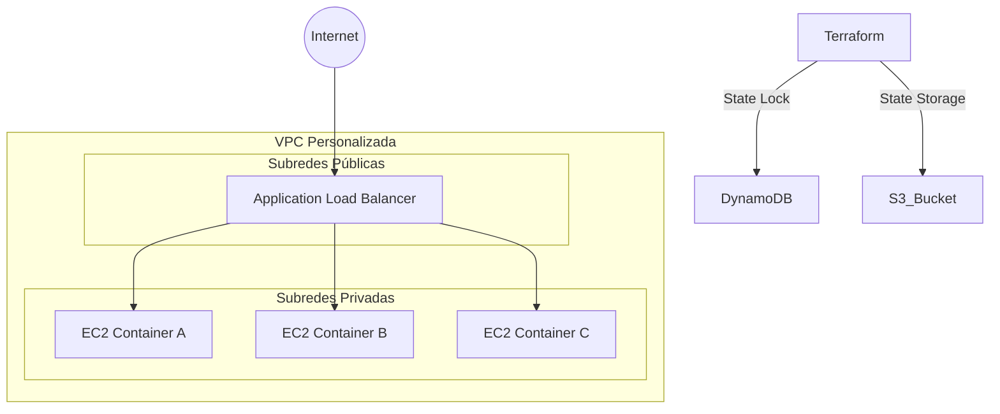

# 🧀 The Cheese Factory | AWS Infrastructure


> **Infraestructura como Código (IaC)** para el despliegue automatizado, seguro y escalable de la aplicación distribuida "The Cheese Factory".

## 📋 Descripción del Proyecto

Este repositorio contiene la definición declarativa de la infraestructura necesaria para ejecutar la aplicación web "The Cheese Factory" en Amazon Web Services (AWS).

El proyecto demuestra competencias avanzadas en **DevOps**, implementando una arquitectura de 3 capas, gestión de estado remoto con bloqueo (State Locking), y principios de seguridad de **Mínimo Privilegio**.

### 🏗️ Arquitectura de Alto Nivel

El tráfico fluye desde internet hacia un balanceador de carga público, el cual distribuye las peticiones hacia contenedores aislados en redes privadas.


## 🚀 Características Técnicas

Este despliegue cumple con estándares de industria:

| Característica | Implementación |
| :--- | :--- |
| **Red Segura** | VPC Personalizada con separación estricta entre subredes Públicas (ALB) y Privadas (App). |
| **Alta Disponibilidad** | Distribución en 3 Zonas de Disponibilidad (AZs) con Load Balancing automático. |
| **Gestión de Estado** | Backend remoto en S3 con bloqueo de concurrencia vía DynamoDB (evita corrupción de estado). |
| **Seguridad (SG)** | **ALB:** Solo puerto 80 desde `0.0.0.0/0`. <br> **EC2:** Solo tráfico HTTP proveniente del Security Group del ALB. |
| **Modularidad** | Uso de módulos oficiales verificados (`terraform-aws-modules`). |
| **Lógica Condicional** | Adaptabilidad de entorno: `prod` (`t3.small`) vs `dev` (`t2.micro`). |

## 📂 Estructura del Repositorio

El proyecto sigue una estrategia de **Monorepo** organizado en dos fases lógicas:

```
.
├── 01_Bootstrap/                # [Fase 1] Infraestructura Base (State Locking)
│   ├── main.tf                  # Lógica para crear Bucket S3 y DynamoDB Table
│   ├── outputs.tf               # Muestra los nombres de los recursos creados
│   ├── variable.tf              # Definición de variables del bootstrap
│   └── terraform.tfvars         # Valores específicos (nombre del bucket, etc.)
│
└── 02_Infraestructura/          # [Fase 2] Infraestructura de Aplicación (VPC, EC2, ALB)
    ├── main.tf                  # Orquestador principal de la infraestructura
    ├── backend.tf               # Configuración para conectar con el S3 remoto
    ├── variables.tf             # Definición de todas las variables requeridas
    ├── outputs.tf               # Salidas importantes (Ej: DNS del Load Balancer)
    ├── user_data.sh             # Script Bash para instalar Docker y desplegar la app
    ├── terraform.tfvars         # Archivo con tus valores (NO subir credenciales aquí)
    ├── terraform.tfvars.example # Plantilla de ejemplo para otros desarrolladores
    └── Quesos                   # Archivos o recursos estáticos de la aplicación
```
## 🛠️ Requisitos Previos

Este entorno ha sido diseñado y validado bajo las siguientes especificaciones. Asegúrate de tenerlas para garantizar la compatibilidad:

* **Sistema Operativo:** Ubuntu 22.04 LTS / 24.04 LTS (o subsistema WSL2).
* **Virtualización:** VMware Workstation (Entorno de desarrollo local).
* **Herramientas CLI:**
    * `terraform` (v1.5+): Para el aprovisionamiento de recursos.
    * `aws-cli` (v2): Configurado con credenciales (`aws configure`).
    * `git`: Para el control de versiones.

---

## ⚙️ Configuración del Entorno

La infraestructura es agnóstica al entorno, lo que significa que puedes personalizarla mediante variables sin tocar el código fuente.

1.  Ubícate en la carpeta de la infraestructura principal:
    ```
    cd 02_Infraestructura
    ```

2.  Genera tu archivo de configuración personal basado en la plantilla:
    ```
    cp terraform.tfvars.example terraform.tfvars
    ```

3.  Edita `terraform.tfvars` con tus valores específicos:
    ```hcl
    aws_region    = "us-east-1"
    environment   = "dev"          # Opciones: "dev" (t2.micro) o "prod" (t3.small)
    my_ip         = "190.x.x.x/32" # TU IP pública para acceso SSH (seguridad)
    docker_images = [
      "errm/cheese:wensleydale",
      "errm/cheese:cheddar",
      "errm/cheese:stilton"
    ]
    ```

> **⚠️ Nota de Seguridad:** El archivo `terraform.tfvars` contiene información sensible y ha sido incluido en `.gitignore` para no ser subido al repositorio público.

---

## ⚡ Guía de Despliegue (Paso a Paso)

Debido a la arquitectura de estado remoto, el despliegue se realiza en dos fases ordenadas.

### Fase 1: Bootstrap (Backend S3)
*Objetivo: Crear el Bucket S3 y la tabla DynamoDB para almacenar el estado de Terraform de forma segura.*

```
cd 01_Bootstrap
```
#### 1. Inicializar y descargar proveedores
```
terraform init
```
#### 2. Desplegar recursos de backend
```
terraform apply -auto-approve
```

### Fase 2: Infraestructura Principal (The Cheese Factory)
*Objetivo: Desplegar la red, balanceadores y servidores de aplicación.*
```
cd ../02_Infraestructura
```
#### 1. Inicializar (Conectará con el backend creado en la Fase 1)
```
terraform init
```
#### 2. Verificar el plan de ejecución
```
terraform plan
```
#### 3. Aplicar la infraestructura en AWS
```
terraform apply -auto-approve
```

---

## ✅ Verificación y Pruebas
1. Una vez finalizado el comando apply, Terraform mostrará los "Outputs" en la terminal.

2. Busca el output llamado alb_dns_name (o similar en tu archivo outputs.tf).

3. Copia la URL (ej: http://cheese-lb-xxxx.us-east-1.elb.amazonaws.com).

4. Abre tu navegador y pega la URL.

Prueba de Balanceo: Refresca la página múltiples veces. Deberás ver cómo la imagen y el tipo de queso cambian, confirmando que el Load Balancer está distribuyendo tráfico entre las 3 instancias.

---

## 🗑️ Destrucción de Recursos
Para evitar cobros indeseados en AWS, sigue este orden estricto para desmantelar el laboratorio:

#### 1. Destruir la aplicación (VPC, EC2, ALB)
```
cd 02_Infraestructura
terraform destroy -auto-approve
```
#### 2. Destruir el backend (S3, DynamoDB)
##### Nota: Asegúrate de que el bucket S3 esté vacío antes de ejecutar esto
```
cd ../01_Bootstrap
terraform destroy -auto-approve
```
---
### Trabajo realizado por: Bryan Painemilla | Infra. Como Código
